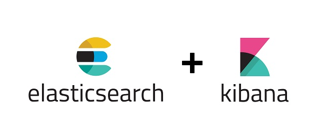

# IBM Watsonx Discovery - Local Kibana Installation
### Watsonx Discovery Kibana Local Installation
  

## Prerequisites
- Ensure that you have docker runtime installed.
- Ensure `envsubst` command is available (Ubuntu/Linux[`sudo apt-get update && apt-get install gettext-base`] OR MacOS[`brew install gettext && brew link --force gettext`])
- Ensure you have OpenSSL 3.x installed.
- Ensure you have cURL installed.
- Ensure you have access to running Watsonx Discovery[Db for Elasticsearch]. (Any Edition: Standard, Enterprise, Platinum)
- Ensure that your local machine is docker image ready.


## STEP 1: Clone the Toolkit
```sh
git clone https://github.ibm.com/JEFFREY-CHIJIOKE-UCHE/watsonx-discovery-kibana-installation-tool.git
cd watsonx-discovery-kibana-installation-tool
cd local
```


## STEP 2: Activate Two Essential Toolkits
```sh
mv .env.deactivated .env
mv cacert.crt.deactivated cacert.crt 
```


## STEP 3: Add Your Elasticsearch Required Variable Values to local store
```sh
Open .env (which has empty values) and then fill in the values as required.
Save .env file.
```


## STEP 4: Paste Elasticsearch TLS/SSL Certificate
```sh
Go to Watsonx Discovery(Elasticsearch) UI then copy the TLS Certificate.
Open cacert.crt (which is empty) and then paste the TLS Certificate you copied.
Save cacert.crt
```


## STEP 5: Run!
```sh
bash start-run.sh
```

--------------------------------------
## STOP LOCAL KIBANA
```sh
bash stop-run.sh
```