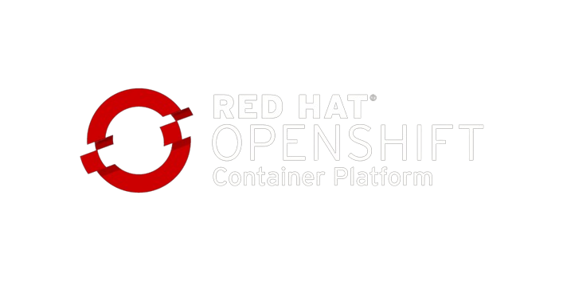

# IBM Watsonx Discovery - Openshift Kibana Deployment
### Watsonx Discovery KIbana OpenShift Deployment
  


<i>Prerequisites:  OpenShift OC CLI</i>   

## STEP 1: Clone the Toolkit
```sh
git clone https://github.ibm.com/JEFFREY-CHIJIOKE-UCHE/watsonx-discovery-kibana-installation-tool.git
cd watsonx-discovery-kibana-installation-tool
cd openshift
```


## STEP 2: Activate the ConfigMap
```sh
mv configMap.yml.deactivated configMap.yml 
```


## STEP 3: Add the Required Values in the ConfigMap
```sh
Open configMap.yml and fill in the required configuration values.
Save configMap.yml file.
```


## STEP 4: Login to Redhat OpenShift & create a project
```sh
oc login --token=YOUR-SERVER-TOKEN --server=YOUR-SERVER-URL
oc new-project elk   
```


## STEP 5: Install ConfigMap on RedHat OpenShift
```sh
oc apply -f configMap.yml
```

## STEP 6: Deploy Kibana on RedHat OpenShift
```sh
oc apply -f kibana-openshift.yml
```

## STEP 7: Get your Kibana OpenShift URL from your project named "elk"
```sh
echo "https://$(oc get route kibana -n elk --template='{{ .spec.host }}')"
```

## STEP 8: Go to the Browser to access Kibana  
```sh
https://kibana-yourproject.apps.yourdomain.yourtld
```